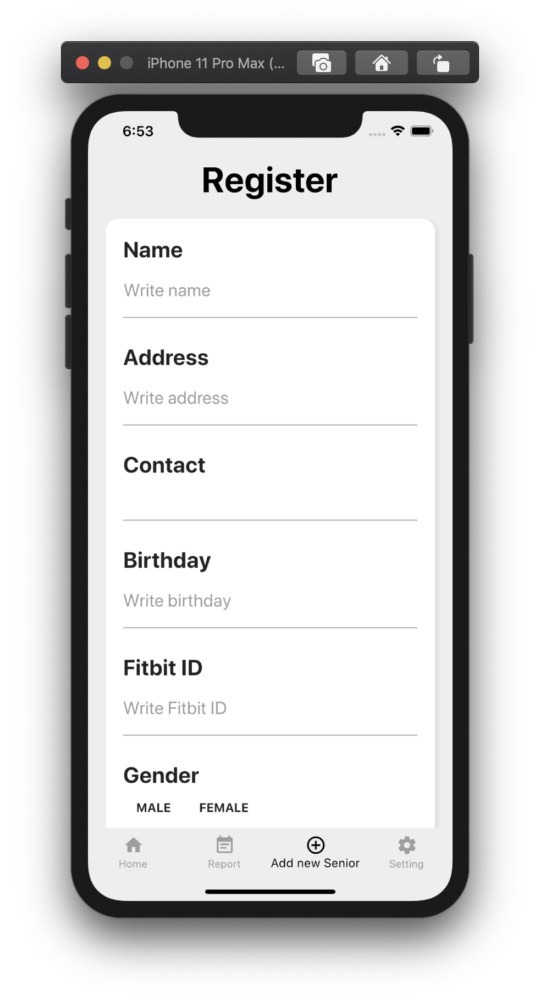

# Care Supporter (DSC-Solution-Challenge-2020)


A Smart App with an wearable device that supports Social workers or Care givers who supports or helps Seniors. 

노인분들을 위한 생활관리사를 돕는 어플

## Screenshots
{: width="50%" height="50%"}
{: width="50%" height="50%"}
{: width="50%" height="50%"}

## Explanation
This project is made by DSC HUFS(Hankuk University of Foreign Studies) for DSC Solution Challenge 2020.

By using Flutter App and Wearable Device Fitbit, Social workers can receive Senior's pulse levels from individuals in real time.


## Installation

Link : 

Flutter App generate :

```bash
git clone https://github.com/DSCHUFS/DSC-Solution-Challenge-2020.git
```

## Usage

```bash
flutter run
```

## Use Stacks
- Flutter
- Firebase Authentication
- Firebase Cloud Firestore
- Firebase Cloud Functions
- Firebase Cloud Messaging
- Django
- FitBit API


## Contributors
- [Hankyul Kim](https://github.com/rlagksruf16)
- [Byunghak Koh](https://github.com/bengHak)
- [Jihyun Lee](https://github.com/jihyunle2)
- [WonHyuk Choi](https://github.com/devluce)
- [Youngjun Park](https://github.com/jun108059)


## License
[MIT](https://choosealicense.com/licenses/mit/)
